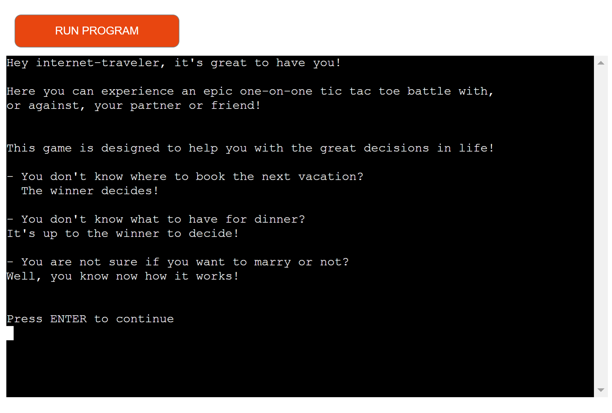
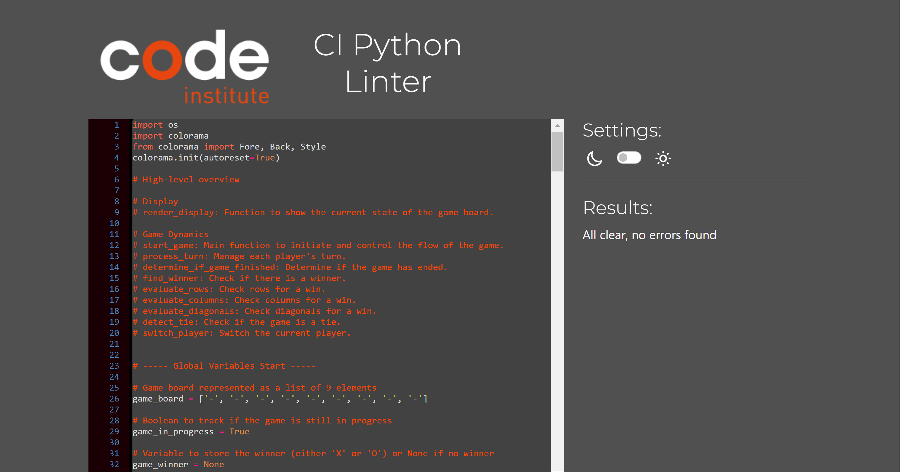

# TIC TAC TOE by Florian

Tic Tac Toe by Florian is the ultimate Tic Tac Toe experience, coded in Python and played in the console. It can be played wherever there is an internet connection!

[Here is the live version of my project](https://tic-tac-toe-f-d43a4214782d.herokuapp.com/)



source: [amiresponsive](https://ui.dev/amiresponsive?url=https://tic-tac-toe-f-d43a4214782d.herokuapp.com/)


## UX

To properly onboard the users, this game begins with a brief introduction, followed by the instructions, and then the actual gameplay.


## How to play

1. The game board is a 3x3 grid with cells numbered 1 to 9:

```
     1 | 2 | 3
    ---|---|---
     4 | 5 | 6
    ---|---|---
     7 | 8 | 9
```

2. Players take turns to place their marks (X or O) on the board. 

3. They enter the cell number where you want to place your mark.

4. Typing 'reset' resets the game.

5. The first player to get three in a row wins. If the board is full and no one has three in a row, it's a draw.


## Features

One of the game's great features is that it allows users to type "reset" into the console to reset the game.

Additionally, the active player switches automatically after each turn.


## Future Features

- Eventually, a version against the computer will be developed.

- Depending on the success of the game, there are plans for a multiplayer version with three to four players and a larger board.


## Tools & Technologies Used

- [](https://tim.2bn.dev/markdown-builder) used to generate README and TESTING templates.
- [](https://git-scm.com) used for version control. (`git add`, `git commit`, `git push`)
- [](https://github.com) used for secure online code storage.
- [](https://gitpod.io) used as a cloud-based IDE for development.
- [](https://www.python.org) used as the back-end programming language.
- [](https://www.heroku.com) used for hosting the deployed back-end site.
- [](https://chat.openai.com) used to help debug, troubleshoot, and explain things.


## Data Model

### Flowchart

To follow best practice, a flowchart was created for the app's logic,
and mapped out before coding began using a free version of
[Lucidchart](https://www.lucidchart.com/pages/ER-diagram-symbols-and-meaning).

Below is the flowchart of the main process of this Python program. It shows the entire cycle of the program.


### Classes & Functions

1. Function to display the current state of the game board
   - def render_display():

2. Function to reset the game state
   - def reset_game():
  
3. Handle a single turn for the given player
   - def process_turn():
  
4. Check if the game is over due to a win or tie
   - def determine_if_game_finished():
  
5. Determine if there is a winner
    - def find_winner():
  
6. Check if any row has all the same value and is not empty
    - def evaluate_rows():

7. Check if any column has all the same value and is not empty
    - def evaluate_columns():
  
8. Check if any diagonal has all the same value and is not empty
    - def evaluate_diagonals():

9. Checks if there is a tie
    - def detect_tie():

10. Flips player, after players turn
    - def switch_player():


## Testing

For the validation I've used [CI Python Linter](https://pep8ci.herokuapp.com/).




## Deployment

Code Institute has provided a [template](https://github.com/Code-Institute-Org/python-essentials-template) to display the terminal view of this backend application in a modern web browser.
This is to improve the accessibility of the project to others.

The live deployed application can be found deployed on [Heroku](https://tic-tac-toe-f-d43a4214782d.herokuapp.com).

### Heroku Deployment

This project uses [Heroku](https://www.heroku.com), a platform as a service (PaaS) that enables developers to build, run, and operate applications entirely in the cloud.

Deployment steps are as follows, after account setup:

- Select **New** in the top-right corner of your Heroku Dashboard, and select **Create new app** from the dropdown menu.
- Your app name must be unique, and then choose a region closest to you (EU or USA), and finally, select **Create App**.
- From the new app **Settings**, click **Reveal Config Vars**, and set the value of KEY to `PORT`, and the value to `8000` then select *add*.
- If using any confidential credentials, such as CREDS.JSON, then these should be pasted in the Config Variables as well.
- Further down, to support dependencies, select **Add Buildpack**.
- The order of the buildpacks is important, select `Python` first, then `Node.js` second. (if they are not in this order, you can drag them to rearrange them)

Heroku needs three additional files in order to deploy properly.

- requirements.txt
- Procfile
- runtime.txt

You can install this project's **requirements** (where applicable) using:

- `pip3 install -r requirements.txt`

If you have your own packages that have been installed, then the requirements file needs updated using:

- `pip3 freeze --local > requirements.txt`

The **Procfile** can be created with the following command:

- `echo web: node index.js > Procfile`

The **runtime.txt** file needs to know which Python version you're using:
1. type: `python3 --version` in the terminal.
2. in the **runtime.txt** file, add your Python version:
	- `python-3.9.19`

For Heroku deployment, follow these steps to connect your own GitHub repository to the newly created app:

Either:

- Select **Automatic Deployment** from the Heroku app.

Or:

- In the Terminal/CLI, connect to Heroku using this command: `heroku login -i`
- Set the remote for Heroku: `heroku git:remote -a app_name` (replace *app_name* with your app name)
- After performing the standard Git `add`, `commit`, and `push` to GitHub, you can now type:
	- `git push heroku main`

The frontend terminal should now be connected and deployed to Heroku!

### Local Deployment

This project can be cloned or forked in order to make a local copy on your own system.

For either method, you will need to install any applicable packages found within the *requirements.txt* file.

- `pip3 install -r requirements.txt`.

If using any confidential credentials, such as `CREDS.json` or `env.py` data, these will need to be manually added to your own newly created project as well.

#### Cloning

You can clone the repository by following these steps:

1. Go to the [GitHub repository](https://github.com/fgit-24/tic-tac-toe-florian) 
2. Locate the Code button above the list of files and click it 
3. Select if you prefer to clone using HTTPS, SSH, or GitHub CLI and click the copy button to copy the URL to your clipboard
4. Open Git Bash or Terminal
5. Change the current working directory to the one where you want the cloned directory
6. In your IDE Terminal, type the following command to clone my repository:
	- `git clone https://github.com/fgit-24/tic-tac-toe-florian.git`
7. Press Enter to create your local clone.

Alternatively, if using Gitpod, you can click below to create your own workspace using this repository.

[](https://gitpod.io/#https://github.com/fgit-24/tic-tac-toe-florian)

Please note that in order to directly open the project in Gitpod, you need to have the browser extension installed.
A tutorial on how to do that can be found [here](https://www.gitpod.io/docs/configure/user-settings/browser-extension).

#### Forking

By forking the GitHub Repository, we make a copy of the original repository on our GitHub account to view and/or make changes without affecting the original owner's repository.
You can fork this repository by using the following steps:

1. Log in to GitHub and locate the [GitHub Repository](https://github.com/fgit-24/tic-tac-toe-florian)
2. At the top of the Repository (not top of page) just above the "Settings" Button on the menu, locate the "Fork" Button.
3. Once clicked, you should now have a copy of the original repository in your own GitHub account!


## Credits

For the base mechanics, I watched the YouTube video [TIC TAC TOE project](https://youtu.be/BHh654_7Cmw) by [Clever Programmer](https://www.youtube.com/@CleverProgrammer).

After that, I started from scratch, and most of my mechanics work differently.


### Content

| Source | Location | Notes |
| --- | --- | --- |
| [Markdown Builder](https://tim.2bn.dev/markdown-builder) | README and TESTING | tool to help generate the Markdown files |


### Acknowledgements

- I would like to thank my Code Institute mentor, [Tim Nelson](https://github.com/TravelTimN) for his support throughout the development of this project.